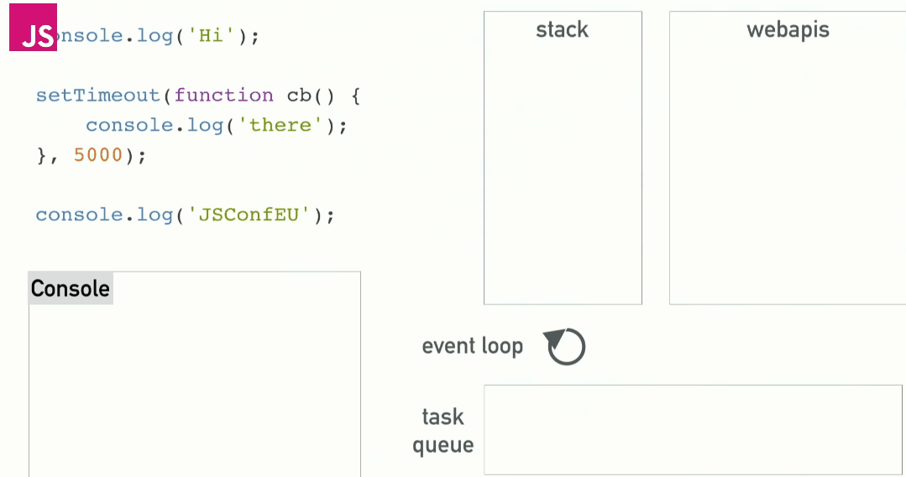

# Overview

| Week |                                       Exercise                                       |
|:----:|:------------------------------------------------------------------------------------:|
|   1  | https://docs.google.com/document/d/1ad-D5zPpobOUAG5cdcFt1YU3yCAqilN2KOGzrjvWnq8/edit |
|   2  | https://docs.google.com/document/d/16uX1YKzWGGz4tG112zlxp93oSTtH7SNiNvpXtdLW7nM/edit |
|   3  | https://docs.google.com/document/d/1jpqmitlHKeIcWzDdbe-jO281xFQiGywP3c2iKCDeffQ/edit |
|   4  | https://docs.google.com/document/d/1PIMMeYPqN8Qzo4qsgjjuNAC0_15RIEVjD0DbBhcaP-0/edit |
|   5  | https://docs.google.com/document/d/1Lxg0SkcKzBkARM3nzS-82xHZfqgDECJA9blTbIjaJTQ/edit |

# Learning goals for period one
https://docs.google.com/document/d/1JQpBvRvFd-qMMV7srqNdYZ6GIYiBjOyxkWIuCJSk2Ec/edit


## Explain and Reflect:

-   Explain the differences between Java and JavaScript, Java and node.
    -   ```that Java is a compiled language and JavaScript a scripted language```
    
    **Compiled** languages are typically compiled to machine code and run on the hardware on the Operating System. For **Java**, the code is compiled into *bytecode* that is interpreted at runtime. (JVM). Compiled languages are meant to build programs that could be compiled into runnables, such as .jar or .exe. 
      
    **Scripted** languages are not compiled but interpreted from its source. They were built to use the existing resources of an app to act the way you want. For **Javascript** the browser will interpret each line of the code and run it.
    ([Great explanation]([https://web.stanford.edu/class/cs98si/slides/overview.html](https://web.stanford.edu/class/cs98si/slides/overview.html)))
	-   ```Java is both a language and a platform```
  
	**Java as a language** is an class-based Object-Oriented programming language. Java is meant to be run on any device as long as it supports the Java platform. Google's Android SDK uses Java language but not for anything else.  
    **Java as a platform** at its core has the Java Virtual Machine (JVM) which executes the bytecode. The platform compiles to bytecode for the sake of the *write once, run anywhere* (WORA) principle. This means that the code can run on any JVM regardless of the underlying architecture.
    The Java platform also provides compilers for other languages such as Javascript, Python and Ruby.
	-  ```General differences in language features.```
  
	**Java** is a compiled language that works with bytecode and is executed through the JVM which ensures OS support (Windows, Linux, iOS). When compiling, the code is checked for several things, including types. This is called **static type checking** and it finds errors during development of the code. Since the compiler knows what types are used, the code in the end is typically run faster.  
Java is through the JVM a multi-threaded language, but there are several blocking operations which should be accounted for by the developer using the included Java multithreading API.  
**Javascript** is a interpreted scripting language, meaning that the code is read line-for-line by the browsers engine. Javascript uses **dynamic type checking** which results in simpler code, but in return might produce errors after development.
	Javascript is single-threaded and concurrency is implemented not through threading but by delegating any future tasks out to relevant APIs. *(Event loop)*
    
	-   ```Blocking vs. non-blocking```  
  **Blocking** (*Synchronous*) is when the code execution halts as it waits for a process to finish.  
  **Non-blocking** (*Asynchronous*) is the opposite where the main thread continues to work.
  
-  ```Node.js, when it “makes sense” and npm, and how it “fits” into the node ecosystem.```  

Javascript was not designed to access the operating system, but with Node.js (a Javascript runtime) it is possible to combine the advantages of the light programming language of Javascript with the powerful engine of V8.  
Node.js excels at asynchronous non-blocking operations, such as I/O. It was used to develop apps for Paypal, Linkedin, Netflix & Uber - all apps that needs to handle hundreds of thousands of users, generate their output based on input, all at the same time, connecting to different services.  
It has great scalability and in conjunction with npm the possibilties are endless.

**npm** (Node Package Manager) handles packages (also "modules") of code shared between developers. Much like libraries and frameworks, utilities that are often-needed can be accessed and save valuable time, increase performance and much more. See: lodash, react, request, express, uuid.
    
-   ```Explain about the Event Loop in JavaScript, including terms like: blocking, non-blocking, event loop, callback que and "other" API's. Make sure to include why this is relevant for us as developers.```
  

([Video](https://youtu.be/8aGhZQkoFbQ) | [.mp4 of gif](https://i.imgur.com/QayP3Nm.mp4) | [Source](http://latentflip.com/loupe/))  
The stack is only occupied by the call to the other API, and can then continue until the stack is empty, then checking the task queue for the callback.

Javascript is single-threaded and therefore you usually see a lot of blocking in your code.  
The way to handle this is by delegating the blocking code to other APIs. 

If the code requires a lot of work done, you can reduce the time it takes by initializing it, delegating it, and then providing it as it is ready. The alternative is to start work on one task, wait til completion, and then begin the next. The way node.js handles callbacks and asynchronous actions reduced loadtime for Netflix by 70%.
    
-   ```Explain the terms JavaScript Engine (name at least one) and JavaScript Runtime Environment (name at least two)```  

**Javascript Engine** is the program that executes the code. Engines started out as simple interpreters, executing code line-by-line.  
Modern engines has Just-In-Time compilation (JIT) which compiles parts of the program where optimization can be found during runtime, opposite of compiling code before runtime. It is generally faster overall, despite a slight startup delay.  

[Notable engines](https://en.wikipedia.org/wiki/JavaScript_engine#Notable_engines)  
V8 from Google powers Chrome, Chromium-apps and Node.js.  
SpiderMonkey from Mozilla powers Firefox.  
Charka from Microsft was used for Edge, which now instead uses V8.

The **Javascript Runtime Environment** is the outer shell ("container"), of which you typically communicate with. This is where stack, heap, garbage collector and other features reside. This is also where all the events that Javascript relies upon are handled, as well as the calls to the other APIs for concurrency are handled.

Javascript and Node.js both use V8, but they have very different runtime environments: in Chrome you have the window, DOM objects etc, while node gives you require, Buffers and processes.

-   ```Explain (some) of the purposes with the tools Babel and WebPack and how they differ from each other. Use examples from the exercises.```

**Babel** is a transpiler. For *older* browsers we often use polyfills for newer features that have yet to be implemented. Babel helps us by allowing us to use certain features across browsers, despite them not being available yet. Typically this is done from e.g. ES6 -> ES5, but it could also be for ESNext -> (CurrentES).

**Webpack** was used this semester as a bundler. It systematically looks throughout your files and bundles them into a pre-decided package, e.g. `bundle.js`. You can apply several techniques underway, such as minifying.

These tools use several dependencies and loaders that are all downloaded through **npm** and then bundled together for maximum efficiency.

## Explain using sufficient code examples the following features in JavaScript (and node)  

-   ```Variable/function-Hoisting```  
https://developer.mozilla.org/en-US/docs/Glossary/Hoisting  

Hoisting means that all declarations are moved to the top of their scope. Both variables and functions.  
Assignments are not hoisted.  
It is adviced to keep variable declarations **and their assignments** together, preferably at the top of their scope.
`let` and `const` are hoisted to their block scope, meaning they are not available outside their block. `var` is always hoisted, therefore available.

    
-   ```this in JavaScript and how it differs from what we know from Java/.net.```  
https://developer.mozilla.org/en-US/docs/Web/JavaScript/Reference/Operators/this  

**In Java**, `this` refers to the current object that is tied to the method. ([Source](https://docs.oracle.com/javase/tutorial/java/javaOO/thiskey.html))  
**In Javascript**, `this` changes depending on where it is used and also if `strict` mode is applied.  
  
For *arrow functions* it is a bit different. Compare it to a normal function, where `this` represents the object that calls the function.  
For an **arrow function**, `this` represents the owner of the function. (Often being the window object - or global in node.js)  
([Source](https://www.w3schools.com/js/js_arrow_function.asp))

    
-   ```Function Closures and the JavaScript Module Pattern```  
**Function closures** are used to keep something as *private* as Javascript allows it to. It allows us to access a certain scope despite it technically being *closed*.  
Examples: https://stackoverflow.com/a/39045098  
Returning a method that accesses a 'private' variable, updating it, and then doing what you want, is a way to implement inner-function variables that you cannot simply access by writing `func.variable`.  

The **Module Pattern** is also about *privacy*. A great example from [here](https://ultimatecourses.com/blog/mastering-the-module-pattern) shows the *reavealing module pattern*:  
```js
var Module = (function () {

  var privateMethod = function () {
    // private
  };

  var someMethod = function () {
    // public, can access privateMethod
  };

  var anotherMethod = function () {
    // public, can access privateMethod
  };

  return {
    someMethod: someMethod,
    anotherMethod: anotherMethod
  };

})();
```  

We would access it by using the IIFE (Ensure function is executed immediately and variables are only within scope), either `Module.someMethod();` or `Module.anotherMethod();` but could not access *privateMethod*.
    
-   ```User-defined Callback Functions (writing your own functions that take a callback)```  
There are several uses for callbacks.  
If we have several usecases with the same parameters, we can make it easier and cleaner by using callbacks.  
By example, a calculator:  
```js
function multiply(val1, val2) {
  return val1 * val2;
}

function substract(val1, val2) {
  return val1 - val2;
}

function calculator(val1, val2, callback) {
  return callback(val1, val2)
}

let multiply_example = calculator(2, 2, multiply);
let substraction_example = calculator(10, 2, substract);
console.log(multiply_example); //4
console.log(substraction_example); //8
```
Both methods take use of `calculator()` but they provide different results depending on the provided callback
    
-   ```Explain the methods map, filter and reduce```  
All are methods on Array:  
https://developer.mozilla.org/en-US/docs/Web/JavaScript/Reference/Global_Objects/Array/map  
https://developer.mozilla.org/en-US/docs/Web/JavaScript/Reference/Global_Objects/Array/filter  
https://developer.mozilla.org/en-US/docs/Web/JavaScript/Reference/Global_Objects/Array/Reduce  

`Map()` creates a new array with the results of using a provided function on every element of the original array.  
```js
const testData = [2, 4, 6, 8];

const result = testData.map(element => element * 2);

console.log(result); //[4, 8, 12, 16]
```  

In the example we multiply every element by 2.

`Filter()` creates a new array with the elements of the original array that passes a test.  
```js
const testData = ["Hej", "Med", "Dig", "Harald"];

const result = testData.filter(word => word.startsWith("H"));

console.log(result); //["Hej", "Harald"]
```  
In this example we are only interested in the words starting with **H**.

`Reduce()` applies a special *reducer*-function to every element and returns a single value result.
```js
const testData = [25,50,75,100];

const result = testData.reduce((total, current) => total + current);

console.log(result); //25 + 50 + 75 + 100 = 250
```  
In this example we add every value to the accumulator and finally return it.  
It is worth noting that reduce takes 4 parameters (acc, cur, idx, array).
    
-   ```Provide examples of user-defined reusable modules implemented in Node.js (learnynode - 6)```  
https://github.com/Runi-VN/JavascriptElective/tree/master/period_one/ClassExercises_Learnyounode/make-it-modular  
(Re-write)  
-   ```Provide examples and explain the es2015 features: let, arrow functions, this, rest parameters, destructuring objects and arrays, maps/sets etc.```

Variables declared by `var` keyword are scoped to the immediate function body (hence the function scope) while **`let`** and `const` variables are scoped to the immediate enclosing block denoted by { }. ([Source](https://stackoverflow.com/a/11444416))  

Examples:  
```js
{
	var x = 1;
	let y = 1;
	const z = 1;
}
console.log(x); // 1
console.log(y); // undefined because 'y' has block scope
console.log(z); // undefined because 'z' has block scope

...

for (var i = 0; i < 5; ++i) {}
console.log(i); // 5 - defined to the outside scope (note this is outside the loop!)

for (let j = 0; j < 5; ++j) {}
console.log(j); // undefined (note this is outside the loop!)
```


**arrow functions** are a new way in ES6 to write functions significantly shorter than previously.  
In regards to `this` in arrow functions it differs a bit:  
*In regular functions the `this` keyword represented the object that called the function, which could be the window, the document, a button or whatever.*

*With arrow functions the `this` keyword always represents the object that defined the arrow function.* (Which is very often the window/global object)  
([Source, Examples](https://www.w3schools.com/js/js_arrow_function.asp)) | [More on Lexical Scoping](https://www.freecodecamp.org/news/learn-es6-the-dope-way-part-ii-arrow-functions-and-the-this-keyword-381ac7a32881/)

Examples:  
```js
// ES5
var subtract = function(val1, val2) {
  return val1 - val2;
};
// ES6
const subtract = (val1, val2) => val1 - val2 ;
```

**`this`** is discussed above.

**[rest parameters](https://developer.mozilla.org/en-US/docs/Web/JavaScript/Reference/Functions/rest_parameters)** are a way to pass multiple parameters to a function. The same syntax, `...`, is used in Java and in Python we use `*` or `**`.

**destructuring data structures** is an easy, short way to unpack collection properties into variables. It is something we often see in React.js.

Examples:  
```js

var someArray = [1, 2, 3];

//destructuring an array
var [first, second, third] = someArray; //first, second, third is now someArray[0], someArray[1] and someArray[2]

//destructuring an object
var { foo, bar } = { foo: "lorem", bar: "ipsum" };

//Destructuring other collections are particular useful when they have the same name

//Using destructuring for function parameters
var sayHello = function({ name, surname }) {
  console.log(`Hello ${name} ${surname}! How are you?`);
};

sayHello({ name: 'John', surname: 'Smith' }) // Hello John Smith! How are you?
```
[Source](https://www.jstips.co/en/javascript/use-destructuring-in-function-parameters/)

-   ```Provide an example of ES6 inheritance and reflect over the differences between Inheritance in Java and in ES6.```  
https://github.com/Runi-VN/JavascriptElective/blob/master/period_one/Week%205/src/ex4_classes_inheritance.ts  
(re-write, mention that ToString() could be overwritten)

Java uses Class Inheritance, and while it might seem that Javascript does the same, it does not.  
Javascript uses Prototypal inheritance, which is syntactic sugar for something that reminds you of OOP Class Inheritance:

```js
class Foo {}
typeof Foo // 'function'
```
[Good source](https://medium.com/javascript-scene/master-the-javascript-interview-what-s-the-difference-between-class-prototypal-inheritance-e4cd0a7562e9) | [MDN on the Prototype Chain](https://developer.mozilla.org/en-US/docs/Web/JavaScript/Inheritance_and_the_prototype_chain)  | [W3S on Prototypes](https://www.w3schools.com/js/js_object_prototypes.asp)  

Every construct in Javascript is `Object`. It uses `Prototype` and `super()` to check back in the chain for any and all connections.  
So instead of constructing copies of a Class and extending them, it actually links the classes together. [Source](https://stackoverflow.com/a/12201800)  
    
-   ```Explain and demonstrate, how to implement your own events, how to emit events and how to listen for such events```
https://github.com/Runi-VN/JavascriptElective/tree/master/period_one/Week%202  
(re-write, find other example? Castau has one)  

## ES6,7,8,ES-next and TypeScript

-   ```Provide examples with es-next, running in a browser, using Babel and Webpack```  
We have not done this.
    
-   ```Explain the two strategies for improving JavaScript: Babel and ES6 (es2015) + ES-Next, versus Typescript. What does it require to use these technologies: In our backend with Node and in (many different) Browsers```  

**Babel and ES6/ES-Next** is a way to compile and transpile code. For older browsers you need *polyfills* that allow newly implemented methods to work for older browsers (in some cases). Babel allows you to write code your way and increase accessability. It also allows you to implement yet-to-be-released proposals and future additions to ecmascript.   

>Babel is a toolchain that is mainly used to convert ECMAScript 2015+ code into a backwards compatible version of JavaScript in current and older browsers or environments. Here are the main things Babel can do for you:  
Transform syntax  
Polyfill features that are missing in your target environment (through @babel/polyfill)  
Source code transformations (codemods)  

[Source](https://babeljs.io/docs/en/index.html#babel-is-a-javascript-compiler)

**Typescript** is a highlayer language ontop of Javascript, a *superset*, that compiles to plain Javascript. Its purpose is to ease development. It increases the potential of Javascript by adding types and even has a built in transpiler.
    
-   ```Provide a number of examples to demonstrate the benefits of using TypeScript, including, types, interfaces, classes and generics```  
Examples: https://github.com/Runi-VN/JavascriptElective/tree/master/period_one/Week%205  
(re-write)  
    
-   ```Explain the ECMAScript Proposal Process for how new features are added to the language (the TC39 Process)```  

https://medium.com/free-code-camp/ecmascript-tc39-and-the-history-of-javascript-26067498feb9  
Stage 0: Strawperson — to allow input into specifications  
Stage 1: Proposal — make the case for the addition, describe the solution and identify the potential challenges  
Stage 2: Draft — describe the syntax and semantics using formal spec language  
Stage 3: Candidate — states that further refinement will need feedback from implementations and users  
Stage 4: Finished — states that the addition is ready for inclusion in the formal ECMAScript standard  
[Source](https://medium.com/swlh/understanding-tc39-process-and-stage-3-specifications-f0b6914d5d24)  

## Callbacks, Promises and async/await

Explain about (ES-6) promises in JavaScript including, the problems they solve, a quick explanation of the Promise API and:

From [MDN](https://developer.mozilla.org/en-US/docs/Web/JavaScript/Reference/Global_Objects/Promise) on `Promise`:  
>A Promise is a proxy for a value not necessarily known when the promise is created. It allows you to associate handlers with an asynchronous action's eventual success value or failure reason. This lets asynchronous methods return values like synchronous methods: instead of immediately returning the final value, the asynchronous method returns a promise to supply the value at some point in the future.

>A Promise is in one of these states:

>pending: initial state, neither fulfilled nor rejected.  
fulfilled: meaning that the operation completed successfully.  
rejected: meaning that the operation failed.  

  

-   ```Example(s) that demonstrate how to avoid the callback hell (“Pyramid of Doom")```  

Example of callback hell: https://github.com/Runi-VN/JavascriptElective/blob/master/period_one/Week%203/Exercise1.js  

```js
function getPlanetforFirstSpeciesInFirstMovieForPerson(id) {
  let person = {};
  fetch("https://swapi.co/api/people/" + id)
    .then(res => res.json())
    .then(data => {
      //Luke all data
      person.name = data.name;
      return data.films[0]; //get first film entry
    })
    .then(film_url => fetch(film_url))
    .then(res => res.json())
    .then(data => {
      //Movie all data
      person["First film"] = data.title;
      return data.species[0]; //get first specie entry
    })
    .catch(err => console.log("Error: ", err))
    .finally(() =>
      console.log("Promises Done, data:\n", JSON.stringify(person, null, "\t"))
    );
}
```  
[Source + Async/Await edt.](https://github.com/Runi-VN/JavascriptElective/blob/master/period_one/Week%203/Exercise2.js)  
**(re-write, OTHER?)**  
    
-   ```Example(s) that demonstrate how to execute asynchronous (promise-based) code in serial or parallel```  
https://github.com/Runi-VN/JavascriptElective/blob/master/period_one/Week%203/Exercise3.js  
(re-write)  

**Also Promise.all** https://github.com/Runi-VN/JavascriptElective/blob/master/period_one/Week%203/Exercise1.js#L86  
    
-   ```Example(s) that demonstrate how to implement our own promise-solutions.```  
https://developer.mozilla.org/en-US/docs/Web/JavaScript/Guide/Using_promises  

```js
function getData() {
    return new Promise((resolve, reject)=>{
        request( `http://www.omdbapi.com/?t=The+Matrix`, (error, res, movieData)=>{
            if (error) reject(error);
            else resolve(movieData);
        });
    });
}

getData()
    .then(data => console.log(data))
    .catch(error => console.log(error));
```  
[Source](https://scotch.io/@wesleylhandy/writing-your-own-javascript-promises)  

-   ```Example(s) that demonstrate error handling with promises```  
1 catch for all causes is typical for promises, where with callbacks you'd have to catch every time:  

```js
try {
  //Operations
  ...
} catch (err) {
//handle err
}

```

## Explain about JavaScripts async/await, how it relates to promises and reasons to use it compared to the plain promise API.

Callbacks -> Promises -> Async/Await (Syntactic Sugar)  
Non-blocking for asynchronous methods  
Async/Await is for the developers benefit - making asynchronous code easier to read and handle. Makes it comparable to synchronous code.  
https://stackoverflow.com/questions/14455293/how-and-when-to-use-async-and-await

```js
// Plain promise
const makeRequest = () =>
  getJSON()
    .then(data => {
      console.log(data)
      return true
    })
makeRequest()

// async/await
const makeRequest = async () => {
  console.log(await getJSON())
  return true
}
makeRequest()
```  

**Provide examples to demonstrate:**

-   ```Why this often is the preferred way of handling promises```  
From [here](https://blog.pusher.com/promises-async-await/) ("Why bother?"):  
Error handling (A single `catch`)  
Conditionals (Easier handling of given/received values)  
Chaining (Rather than `.then` everywhere, we `await`-chain)  
Error reporting done by Promises are less verbose/"correct" than async/await  
Lower Memory Requirements (more stacktraces, details are saved by Promises compared to async/await)  
Clear, concise syntax (Avoid nesting, `.then`, useless named variables, take advantage of anonymous functions)  

```js
// With plain promise
const makeRequest = () => {
    try {
        getJSON()
        .then(result => {
            const data = JSON.parse(result)
            //Handle data, maybe another .then
        })
        .catch((err) => {
            //Handle inner error
        })
    } catch (err) {
        //Handle outer error
    }
}

// With async/await
const makeRequest = async () => {
    try {
        const data = JSON.parse(await getJSON())
        //Handle data, maybe another await
    } catch (err) {
        //Handle single error
    }
}
```
-   ```Error handling with async/await```  
```js
// Plain promises
  const makeRequest = () => {
      return callAPromise()
      .then(() => callAPromise())
      .then(() => callAPromise())
      .then(() => callAPromise())
      .then(() => callAPromise())
      .then(() => {
          throw new Error("oops");
      })
  }

  makeRequest()
      .catch(err => {
          console.log(err);
          // output
          // Error: oops at callAPromise.then.then.then.then.then (index.js:8:13)
      })

  // async/await
  const makeRequest = async () => {
      await callAPromise()
      await callAPromise()
      await callAPromise()
      await callAPromise()
      await callAPromise()
      throw new Error("oops");
  }

  makeRequest()
  .catch(err => {
      console.log(err);
      // output
      // Error: oops at makeRequest (index.js:7:9)
  })
```  
    
-   ```Serial or parallel execution with async/await.```  
```js
  // serial
  const makeRequest = async () => {
      const value1 = await promise1()
      const value2 = await promise2(value1)
      return promise3(value1, value2)
  }

  //parallel
  async function printNamesParallel() {
      const promise1 = fetchPerson(URL + '1');
      const promise2 = fetchPerson(URL + '2');
      (await Promise.all([promise1, promise2])).forEach(result => {
          console.log(result.name);
      });
  }
```
